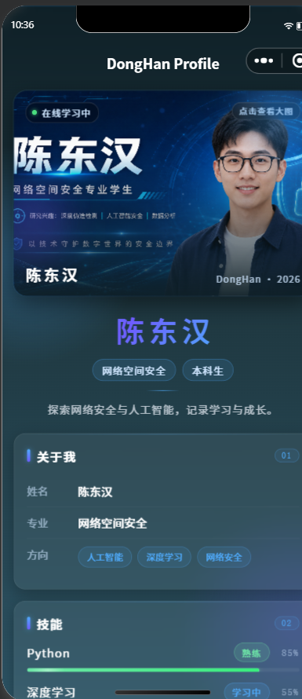
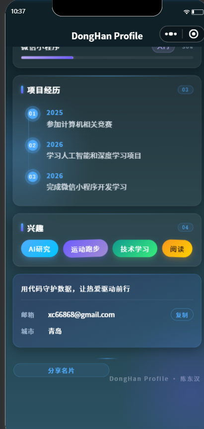

#            实验报告：个人数字名片微信小程序

姓名：陈东汉 &nbsp;&nbsp; 学号：24020007006

---

| 基本信息 | 内容 |
| :--- | :--- |
| **姓名和学号** | 陈东汉 24020007006 |
| **本实验属于哪门课程** | 中国海洋大学26夏《移动软件开发》 |
| **实验名称** | 实验1：第一个微信小程序 |
| **博客地址** | http://ardairo.xyz |
| **github链接** | https://github.com/cdh703/WechatDemo |

---

## 一、实验内容

开发一个科技感个人数字名片微信小程序，展示个人信息、技能、项目经历和兴趣爱好。

**页面结构：**

- 顶部 AI 名片头图，带呼吸状态指示灯与渐变遮罩
- 姓名区域，渐变色字体 + 专业标签 
- 关于我卡片：姓名、专业、研究方向
- 技能展示卡片：技能列表 + 可视化进度条
- 项目经历卡片：时间线设计，节点带脉冲动画
- 兴趣标签云：渐变色块展示
- 底部联系卡片：邮箱一键复制

**技术要点：**

- 数据放入 `data`，使用 `wx:for` 动态渲染
- `IntersectionObserver` 实现滚动入场动画
- 深色渐变背景 + 玻璃拟态卡片设计
- 原生开发（WXML/WXSS/JS），无第三方框架

**页面截图：**

<i>图 1：顶部 Banner 与个人介绍区</i>

 

<i>图 2：技能进度条与时间线展示</i>

---

## 二、问题总结与体会

**遇到的问题：**

1. **图片加载失败**：`images/` 目录下的图片需以 `/` 开头引用，修正路径后解决。

2. **毛玻璃效果不生效**：`backdrop-filter` 在 Skyline 渲染器下不支持，改用 webview 渲染后恢复正常。

3. **滚动动画未触发**：`IntersectionObserver` 的选择器格式错误，缺少 `#` 前缀，修正后实现入场动画。

**体会与建议：**

- 小程序 UI 设计的细节（过渡、阴影、微交互）对用户体验影响很大
- 数据驱动视图让代码更清晰，易于维护
- 建议课程增加 UI/UX 设计指导与动画实战内容
