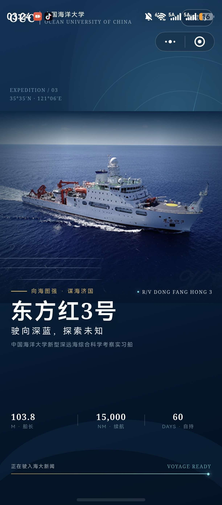
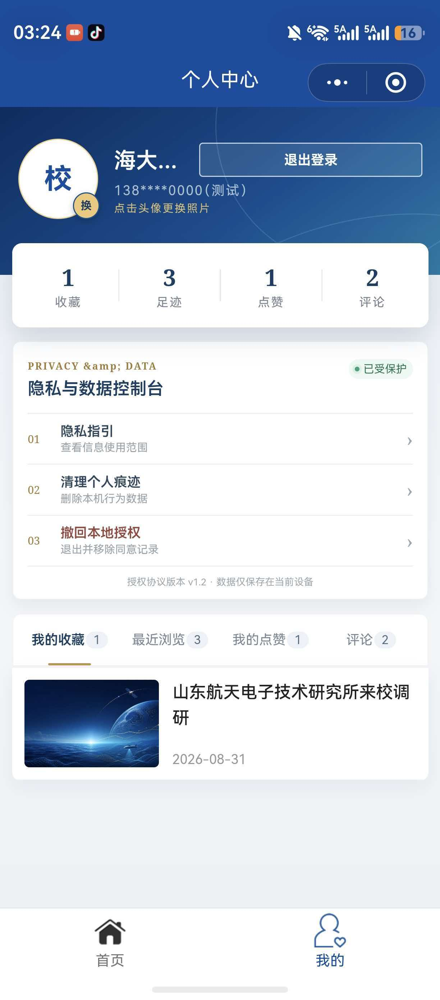
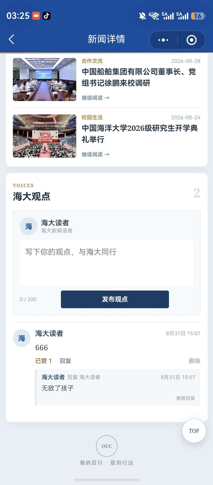

#            实验报告：高校新闻网微信小程序

姓名：陈东汉 &nbsp;&nbsp; 学号：24020007006

---

| 基本信息 | 内容 |
| :--- | :--- |
| **姓名和学号** | 陈东汉 24020007006 |
| **本实验属于哪门课程** | 中国海洋大学26夏《移动软件开发》 |
| **实验名称** | 实验3：高校新闻网 |
| **博客地址** | http://ardairo.xyz |
| **github链接** | https://github.com/cdh703/WechatDemo |

---

## 一、实验内容

本实验参考周文洁老师《微信小程序开发实战》第十四章，在掌握小程序页面、组件和常用 API 的基础上，使用原生 WXML、WXSS 和 JavaScript 开发一个基于模拟数据的中国海洋大学高校新闻小程序。项目包含开场动画、新闻首页、新闻详情和个人中心等页面，并完成搜索、收藏、点赞、评论、登录权限控制等综合功能。

**页面结构：**

- 开场动画页面：以中国海洋大学“东方红3号”科考船为主题，展示学校标识、科考船信息、动态进度条和进入首页的过渡动画
- 新闻首页：包含学校新闻品牌区、焦点新闻轮播图、关键词搜索、热门搜索、栏目筛选、最新与热榜排序以及新闻卡片列表
- 新闻详情页：展示新闻标题、作者、来源、发布时间、图片、正文和相关推荐，支持阅读字号切换、分享、复制标题、点赞和收藏
- 评论互动区：登录后可以发表评论、给评论点赞、回复评论，也可以删除自己在当前设备保存的评论和回复
- 个人中心：展示收藏、足迹、点赞、评论四项数据总览，并提供头像更换、隐私说明、数据清理、退出登录和撤回本地授权等功能

**主要功能：**

- 使用 `common.js` 统一管理新闻模拟数据，首页与详情页根据新闻 `id` 读取对应内容

- 搜索范围覆盖标题、关键词、栏目、作者、来源、摘要和新闻正文，输入文中相关词即可找到对应文章

- 支持热门关键词、搜索历史去重和按最近搜索顺序排列，方便再次检索

- 使用 `wx.setStorageSync` 和 `wx.getStorageSync` 在本机保存登录状态、浏览足迹、收藏、点赞、评论和头像信息

- 未登录用户点击点赞、收藏、评论、评论点赞或回复时，会被引导到“我的”页面完成登录，避免匿名状态直接操作个人数据

- 登录流程包含协议勾选、头像昵称授权说明和手机号测试授权说明，课程测试模式不读取或上传真实手机号

- 新闻图片下载到项目本地并进行压缩，在保证显示效果的同时控制小程序上传包体积

- 支持下拉刷新、返回顶部、阅读进度、评论字数统计和个人数据清理等辅助交互

  

**页面截图：**

<i>图 1：东方红3号科考船开场动画页面</i>

 

<i>图 2：首页焦点轮播、新闻搜索与栏目筛选</i>

 

<i>图 3：首页头条卡片与新闻列表</i>

 

<i>图 4：个人中心数据总览与隐私控制台</i>

 

<i>图 5：新闻详情页评论、点赞与回复功能</i>

---

## 二、问题总结与体会

**遇到的问题：**

1. **真机调试包体积超限**：最初开场动画图片和新闻原图体积较大，自动真机调试提示源码包超过 2 MB。将图片转换并压缩为适合移动端展示的尺寸，同时排除无关素材目录后，解决了上传失败和动画无法加载的问题。

2. **详情页图片无法正常显示**：在详情页中将 `.poster image` 的宽度设置为 `100%` 时，部分图片不能正确计算显示尺寸。结合小程序图片组件的布局方式，将宽度改为明确的 `700rpx`，并使用 `mode="widthFix"` 保持图片比例后能够稳定显示。

3. **搜索结果过于严格**：最初搜索主要匹配新闻标题，输入正文中的人物或事件名称无法找到文章。后来为每篇新闻生成完整的 `searchText`，将标题、关键词、作者、来源、摘要和正文一起转为小写匹配，实现了文章全文范围内的相关词检索。

4. **未登录状态仍可能触发互动**：点赞、收藏和评论分别保存在不同的本地数据中，如果只在按钮处判断登录，容易出现遗漏。我将需要身份的操作统一增加登录检查，未登录时给出提示并跳转个人中心，登录完成后才允许写入数据。

5. **微信真实授权不适合课程测试**：真实手机号授权通常需要符合条件的小程序主体、后台接口和解密流程，开发者工具中不能直接获得真实号码。因此本实验采用明确标注的测试授权流程，只保存脱敏测试号码和授权状态，并在登录前展示隐私用途和本地存储说明。

6. **评论与回复的数据关系较复杂**：评论既要记录所属新闻，又要保存点赞数和回复数组。实现时为新闻、评论和回复分别设置唯一 `id`，更新后统一写回 Storage，避免给一条评论点赞时影响其他新闻的评论数据。

**体会与建议：**

- 这次实验让我把页面跳转、列表渲染、Storage、媒体选择和用户交互等知识组合到一个完整项目中，对小程序的数据流有了更清楚的认识

- 新闻类小程序不只是展示内容，搜索、阅读记录、登录权限和评论互动会直接影响实际使用体验

  
