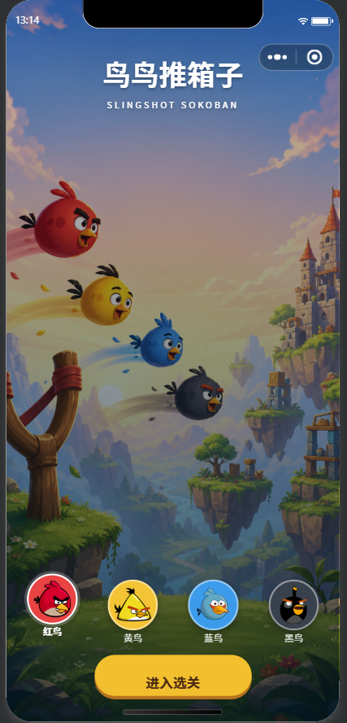
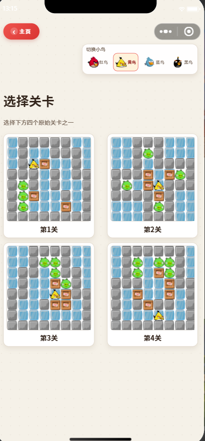
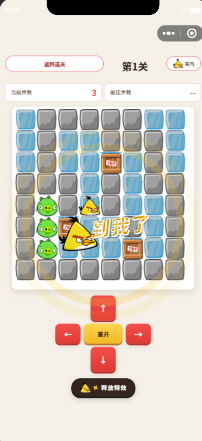
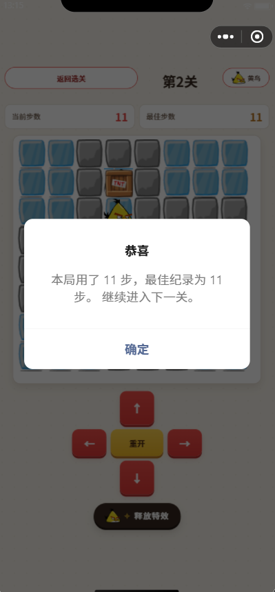

#            实验报告：推箱子游戏微信小程序

姓名：陈东汉 &nbsp;&nbsp; 学号：24020007006

---

| 基本信息 | 内容 |
| :--- | :--- |
| **姓名和学号** | 陈东汉 24020007006 |
| **本实验属于哪门课程** | 中国海洋大学26夏《移动软件开发》 |
| **实验名称** | 实验4：推箱子游戏 |
| **博客地址** | http://ardairo.xyz |
| **github链接** | https://github.com/cdh703/WechatDemo |

---

## 一、实验内容

本实验开发了一个经典的推箱子游戏微信小程序，实现了传统推箱子游戏的核心玩法。项目包含首页选择角色、关卡选择、游戏界面、特效动画以及成功通关跳转等功能模块，通过精美的界面设计和流畅的游戏体验，重现了经典益智游戏的魅力。

**页面结构：**

- 首页：展示不同小鸟角色供玩家选择，每个角色都有独特的外观和特性，玩家可以根据喜好选择心仪的角色开始游戏
- 关卡选择页面：提供多个难度递增的关卡供玩家挑战，清晰展示关卡解锁状态和完成情况，让玩家可以自由选择挑战难度
- 游戏界面：核心推箱子玩法区域，包含地图布局、箱子、目标点、玩家角色等元素，支持触控操作和步数统计
- 特效页面：包含"到我了""我来！"等互动特效，增强游戏趣味性和玩家参与感
- 成功页面：关卡完成后的庆祝页面，展示通关信息并提供跳转至下一关的功能

**主要功能：**

- 支持多种小鸟角色选择，每个角色拥有独特的外观设计和个性化标识

- 设计了多个精心制作的推箱子关卡，难度逐步递增，满足不同水平玩家的需求

- 实现了完整的推箱子游戏逻辑，包括箱子推动、路径判断、目标匹配等核心机制

- 添加了丰富的视觉特效和交互反馈，提升游戏体验和沉浸感

- 实现了关卡成功判定和自动跳转功能，玩家通关后可无缝进入下一关

- 优化了触控操作体验，确保游戏过程中的流畅性和响应速度

- 集成了音效和动画效果，增强游戏的娱乐性和吸引力

  

**页面截图：**

<i>图 1：首页可以选择不同的小鸟角色</i>

 

<i>图 2：选择关卡页面</i>

 

<i>图 3：特效的页面，有"到我了""我来！"这样的特效</i>

 

<i>图 4：关卡的成功跳转下一页</i>

---

## 二、问题总结与体会

**遇到的问题：**

1. **游戏逻辑实现复杂**：推箱子游戏的状态判断和移动逻辑较为复杂，特别是箱子推动的条件判断和地图状态更新。通过仔细分析游戏规则，分步骤实现移动检测、碰撞处理和胜利条件判断，最终实现了稳定的游戏逻辑。

2. **关卡数据管理**：多个关卡的地图数据需要有效组织和管理，既要保证加载效率又要便于扩展。采用二维数组表示地图布局，并建立独立的关卡数据文件，实现了灵活的关卡管理和快速加载。

3. **触控操作优化**：在移动设备上实现精确的方向控制需要考虑触摸响应和滑动识别。通过监听触摸事件并计算滑动方向，实现了直观的推箱子操作体验。

4. **性能优化**：游戏过程中频繁的状态更新和界面渲染可能导致性能问题。通过优化渲染逻辑和减少不必要的重绘，确保了游戏运行的流畅性。

5. **用户体验设计**：如何在有限的屏幕空间内展示游戏内容并保持良好的操作体验是一个挑战。通过合理的界面布局和交互设计，实现了简洁直观的游戏界面。

6. **角色选择系统集成**：将角色选择功能与游戏主流程整合，需要在保持游戏核心逻辑不变的前提下添加角色切换功能。通过参数化角色数据和状态管理，实现了灵活的角色系统。

**体会与建议：**

- 这次实验让我深入理解了游戏开发中的状态管理和逻辑控制，对小程序的性能优化有了更深刻的认识

- 推箱子这类经典游戏虽然规则简单，但要实现良好的用户体验需要关注很多细节，从界面设计到操作反馈都需要精心打磨
