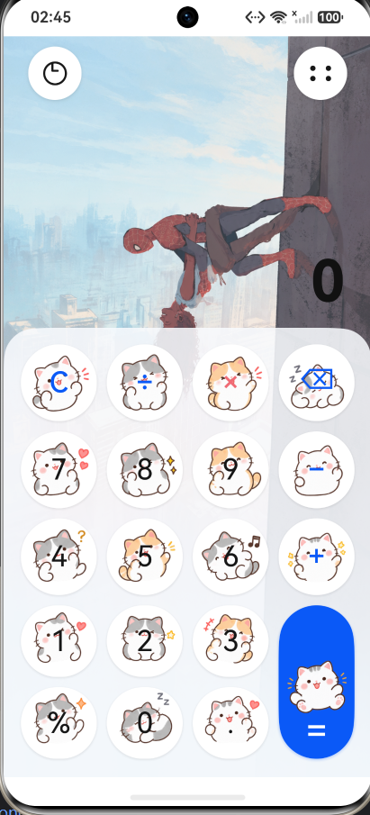
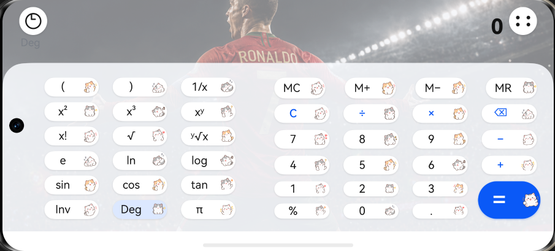

#            实验报告：鸿蒙手机计算器

姓名：陈东汉 &nbsp;&nbsp; 学号：24020007006

---

| 基本信息 | 内容 |
| :--- | :--- |
| **姓名和学号** | 陈东汉 24020007006 |
| **本实验属于哪门课程** | 中国海洋大学26夏《移动软件开发》 |
| **实验名称** | 实验5：鸿蒙手机计算器 |
| **博客地址** | http://ardairo.xyz |
| **github链接** | https://github.com/cdh703/WechatDemo |

---

## 一、实验内容

本实验使用 DevEco Studio 和 ArkTS 开发了一个鸿蒙手机计算器原型，参考华为计算器的界面设计，实现了标准计算器、科学计算器、历史记录和横竖屏自适应等功能。项目重点对计算器的视觉效果和交互细节进行了设计，使页面在手机竖屏和横屏状态下都能够正常使用。

**页面结构：**

- 标准计算器页面：包含运算显示区、历史记录入口、模式切换入口和数字、运算符按键区域，支持加减乘除、百分号、小数点和清除等操作
- 科学计算器页面：在横屏布局中增加括号、倒数、平方、立方、幂运算、阶乘、开方、对数和三角函数等科学计算功能
- 历史记录页面：按照时间展示已经完成的计算记录，可以查看表达式和结果，支持左滑后点击红色删除按钮删除单条记录，也支持右上角垃圾桶清空全部记录
- 启动动画页面：启动时先显示黑屏和巨大的数字 0，再依次出现运算符、数字和计算器按键，最后进入正常计算器界面
- 背景和主题页面：竖屏使用蜘蛛侠插画背景，横屏使用 C 罗图片背景，按键中加入小猫贴纸，增强页面的个性化效果

**主要功能：**

- 实现数字输入、运算符输入、小数点输入、退格删除和清除等基础计算器操作

- 只有点击等号后才计算结果，输入过程中上方显示加粗的大号运算过程，下方显示较小的预览结果，点击等号后结果会放大并加粗显示

- 支持加法、减法、乘法、除法和百分号运算，并对除数为零等异常情况进行提示

- 支持科学计算器模式，可以完成平方、立方、幂、阶乘、平方根、对数和三角函数等运算

- 根据屏幕宽高自动调整布局，竖屏采用四列按键布局，横屏采用科学按键区和标准按键区并列的布局

- 实现历史记录保存、查看和删除功能，计算完成后自动将表达式和结果加入历史记录

- 支持启动动画、按键回弹、轻微震动和界面切换动画，提升操作时的反馈效果

- 对页面高度、顶部状态栏和底部安全区域进行了适配，避免按钮或文字被遮挡

  

**页面截图：**

<i>图 1：竖屏计算器页面，显示蜘蛛侠背景和小猫按键</i>

 

<i>图 2：横屏科学计算器页面，科学按键和标准按键并列显示</i>

---

## 二、问题总结与体会

**遇到的问题：**

1. **横竖屏布局适配问题**：竖屏和横屏的可用空间差异较大，如果直接使用固定宽高，横屏时按键容易被压缩或超出屏幕。通过读取屏幕宽高并设置不同的布局结构，分别设计了竖屏四列按键和横屏双区域按键布局，解决了页面显示不完整的问题。

2. **计算结果显示逻辑**：如果每输入一个数字就直接替换成结果，会影响用户继续输入运算式。因此将运算过程和预览结果分开显示，只有点击等号后才正式计算，并在等号点击后放大结果字体。

3. **科学计算器功能较多**：科学计算器包含三角函数、阶乘、幂运算等不同类型的操作，输入方式和普通四则运算不完全相同。通过统一按键回调和单独处理科学函数，完成了不同计算模式的切换。

4. **历史记录交互实现**：历史记录既要支持点击右上角垃圾桶清空，也要支持单条记录左滑后再点击红色删除按钮。通过记录每一项的滑动状态和删除状态，实现了比较接近手机系统的删除交互。

5. **背景图片和按键内容适配**：加入蜘蛛侠、C 罗图片和小猫贴纸后，图片容易遮挡文字或影响按键识别。通过调整图片透明度、按键内文字区域和贴纸区域的比例，使装饰内容位于按键右侧空白区域，不影响主要文字显示。

6. **启动动画节奏调整**：最初的启动动画速度较快，页面切换显得比较生硬。后来对黑屏停留、数字出现、符号飞入、数字吸入和按键落位的时间进行了重新安排，并增加了回弹和轻微震动效果，使动画更加连贯。

**体会与建议：**

- 计算器看起来是一个比较简单的应用，但真正实现时需要同时考虑计算逻辑、页面排版、屏幕适配、动画效果和用户操作习惯，细节比较多。

- 在移动端开发中，不能只按照一个固定尺寸设计页面，还要考虑横屏、竖屏、状态栏和底部安全区域，否则在不同设备上很容易出现显示不完整的问题。

  
