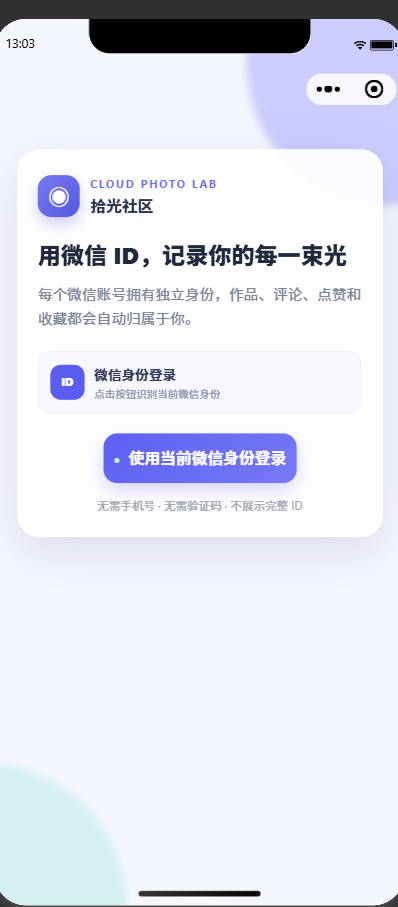
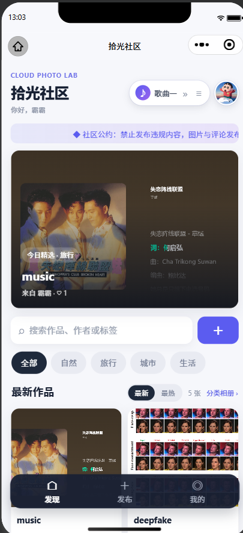
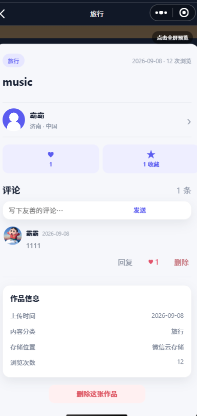
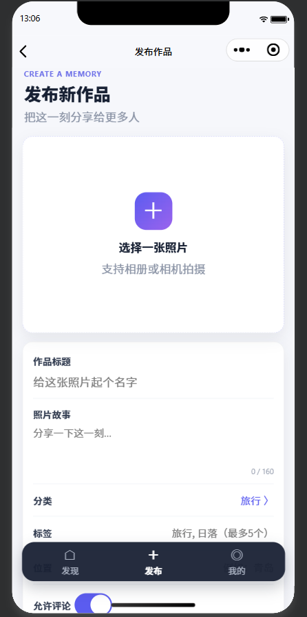
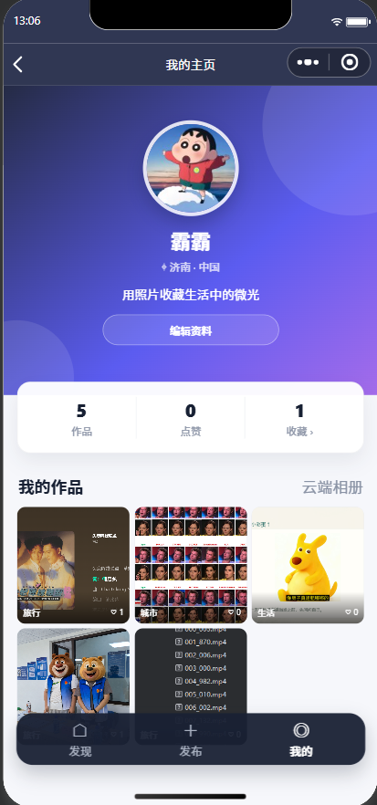

#            实验报告：微信小程序云开发图片社区

姓名：陈东汉 &nbsp;&nbsp; 学号：24020007006

---

| 基本信息 | 内容 |
| :--- | :--- |
| **姓名和学号** | 陈东汉 24020007006 |
| **本实验属于哪门课程** | 中国海洋大学26夏《移动软件开发》 |
| **实验名称** | 实验6：微信小程序云开发图片社区 |
| **博客地址** | http://ardairo.xyz |
| **github链接** | https://github.com/cdh703/WechatDemo |

---

## 一、实验内容

本实验使用微信开发者工具和微信云开发完成了一个名为“拾光社区”的云端图片分享小程序。系统以微信 `OPENID` 作为用户唯一身份标识，使用云数据库保存用户资料、作品信息、评论、点赞和收藏等数据，使用云存储保存用户上传的图片和音乐文件，并通过云函数完成身份获取、互动状态更新、作品删除、浏览量统计和内容安全检测等操作。

在完成实验基础要求的同时，项目进一步加入了微信身份登录、社区信息流、最新与最热排序、图片分类、关键词搜索、背景音乐、评论回复、评论点赞、作品收藏、个人主页和内容安全检测等扩展功能，使原本的云端图片存储功能扩展为一个完整的多用户图片社区。

**页面结构：**

- 登录页面：通过云函数取得当前微信用户的 `OPENID`，不需要手机号、密码或验证码。第一次进入时可以设置头像、昵称、地区和个人简介，再次打开时根据 `OPENID` 自动恢复用户资料
- 社区首页：展示所有用户发布的作品，支持自然、旅行、城市和生活等分类筛选，可以按照“最新”和“最热”两种方式浏览作品，也可以按照作品标题、作者或标签进行搜索
- 音乐播放区域：首页顶部提供迷你音乐播放器，支持播放、暂停、切换歌曲和打开歌单。音乐文件可以上传至微信云存储，再通过云文件地址加入播放列表
- 作品详情页面：展示作品图片、分类、上传时间、浏览量、作者信息和作品说明，支持点赞、取消点赞、收藏、取消收藏、下载、转发和全屏预览
- 评论互动页面：用户可以发表评论、回复评论、给评论或回复点赞，并可以删除自己发布的评论；删除主评论时同步处理回复和相关点赞数据
- 发布作品页面：用户可以从相册选择图片或直接拍照，填写作品标题、照片故事、分类、标签和位置，并设置是否允许评论，图片先上传到云存储，再将云文件 ID 和作品资料写入云数据库
- 个人主页：展示当前用户头像、昵称、地区、简介、作品数量、获赞数量和收藏数量，只显示当前 `OPENID` 对应用户发布的作品，并支持编辑个人资料
- 分类相册页面：将用户作品按照分类进行九宫格展示，支持批量上传、全屏预览、数量统计和长按删除，并根据当前用户身份隔离个人相册内容

**主要功能：**

- 使用 `getOpenid` 云函数获取当前微信用户的唯一身份，通过 `_openid`、`authorOpenid` 和 `userOpenid` 建立用户与作品、评论、点赞和收藏之间的关系

- 使用 `wx.cloud.uploadFile` 将图片上传到 `photos/用户OPENID/` 目录，将用户头像上传到 `avatars/` 目录，并将返回的 `cloud://` 文件 ID 保存到云数据库

- 首页支持分类筛选、关键词搜索、下拉刷新和上拉分页，每页读取固定数量的作品，减少一次性加载的数据量

- “最新”模式按照作品创建时间倒序排列，“最热”模式综合点赞数、收藏数、评论数和浏览量计算热度，使用户能够从不同角度浏览社区内容

- 使用 `BackgroundAudioManager` 实现后台音乐播放，支持播放、暂停、自动切歌、手动切歌和歌单选择；音乐资源保存在微信云存储中

- 点赞、收藏和评论均通过独立集合保存，防止同一用户对同一作品重复点赞或重复收藏，再次点击可以取消对应状态

- 评论采用两级结构，既可以回复主评论，也可以回复某条回复；所有回复保留目标用户昵称，并归入相应的主评论线程

- 只有作品作者可以删除自己的作品，只有评论作者可以删除自己的评论，云函数通过当前用户 `OPENID` 再次检查操作权限

- 删除作品时同时删除云存储文件、作品数据库记录以及对应评论、点赞和收藏记录，避免产生无效数据

- 详情页记录作品浏览次数，使用云函数原子更新 `viewCount`，并在“最热”排序中参与热度计算

- 发布作品和评论前接入微信内容安全检测，对违规文本和图片进行拦截，图片检测失败时及时删除已经上传的云文件

- 对云存储图片的临时访问地址进行缓存，减少重复申请临时链接造成的等待，提高图片再次打开时的加载速度

**扩展与加分功能：**

- 基于微信 `OPENID` 的多用户自动登录与历史资料恢复
- 社区首页“最新/最热”双排序和多分类筛选
- 云端背景音乐、歌曲列表和后台播放
- 评论回复、评论点赞、取消点赞以及本人删除功能
- 独立收藏、浏览量统计、个人主页和分类私有相册
- 云端内容安全检测和作者权限校验

**页面截图：**

<i>图 1：微信身份登录页面，通过 OPENID 区分不同用户，无需手机号、密码或验证码</i>

 

<i>图 2：社区首页，支持作品分类、关键词搜索、最新与最热排序，并提供云端音乐播放功能</i>

 

<i>图 3：作品详情页面，支持作品点赞收藏、评论、回复、评论点赞和本人删除</i>

 

<i>图 4：作品发布页面，可以选择照片并填写标题、故事、分类、标签、位置和评论设置</i>

 

<i>图 5：个人主页，根据当前用户 OPENID 展示头像、个人资料、作品统计和历史作品</i>

---

## 二、问题总结与体会

**遇到的问题：**

1. **云环境和云函数绑定问题**：项目最初创建后，`cloudfunctions` 目录没有选择云环境，导致云函数无法上传和调用。通过在微信开发者工具中将云函数目录绑定到 `cloud1` 环境，并逐个执行“上传并部署：云端安装依赖”，解决了云函数不可用的问题。

2. **多用户身份识别问题**：最初仅根据昵称和头像展示用户，无法可靠区分不同微信账号。后来使用云函数获得微信 `OPENID`，并在 `users`、`photos`、`comments`、`likes` 和 `favorites` 等集合中保存用户身份关系，使不同微信账号能够拥有独立的资料、作品和互动记录。

3. **云存储图片无法显示问题**：图片记录能够从数据库中读取，但页面曾出现灰色占位区域。检查后发现数据库只保存云文件 ID，真实文件位于云存储中，同时免费云环境的存储读取权限受到限制。通过检查 `photoUrl` 是否为完整的 `cloud://` 地址、部署临时链接云函数、缓存可访问地址并清除开发者工具缓存，改善了图片读取问题。

4. **本地路径与云端路径混淆问题**：用户刚选择图片时得到的是 `wxfile://` 临时路径，该路径在小程序关闭后可能失效，因此不能直接保存到数据库。正确流程是先上传至云存储，获得永久云文件 ID，再将该 ID 写入 `photos.photoUrl`。默认头像可以继续使用项目内的 `/assets/images/avatar-default.png`，用户自行选择的头像则上传到云存储。

5. **作品归属判断问题**：测试阶段曾通过修改昵称模拟不同用户，导致两条作品仍被识别为同一个用户。系统最终统一使用 `_openid` 或 `authorOpenid` 判断作品归属，昵称和头像只负责界面展示，不参与身份验证。

6. **互动数据一致性问题**：点赞、收藏、评论和回复会同时影响多张数据表及作品计数。通过云函数执行查询、写入和原子计数更新，限制同一用户的重复操作，并在删除评论或作品时清理关联数据，使页面统计与数据库记录保持一致。

7. **最新与最热排序问题**：仅按照点赞数排列无法全面表示作品热度，因此设计了综合热度计算方式，将点赞、收藏、评论和浏览量按照不同权重计算，并与按照创建时间排列的“最新”模式分开。

8. **音乐播放与云文件访问问题**：本地音乐地址不适合发布后长期使用，因此将音乐文件上传到云存储，使用云文件地址配置歌单，并通过后台音频管理器维护播放状态，实现页面切换后继续播放和歌曲结束后自动切换。

**体会与建议：**

- 微信云开发将身份认证、数据库、云存储和云函数整合在同一个开发环境中，能够在不单独部署服务器的情况下完成一个具有真实后端能力的多用户应用。

- 数据库和云存储承担的职责不同：数据库保存结构化信息和云文件 ID，云存储保存真正的图片与音乐文件。只有正确连接这两部分，才能保证资源在不同设备和不同用户之间正常访问。

- 多用户系统不能依靠昵称或头像判断用户身份，必须使用微信平台提供的 `OPENID`。所有涉及“我的作品”“我的收藏”和删除权限的查询都应该以用户 ID 为依据。

- 云函数不仅可以完成数据处理，还可以作为安全边界。涉及点赞去重、删除权限、内容检测和计数更新的操作放在云函数中，比完全依赖前端判断更加可靠。

- 在移动端应用中，除了实现功能，还需要考虑图片加载速度、网络失败提示、云文件权限、缓存失效以及重复点击等真实使用场景。通过分页、懒加载、临时链接缓存和加载状态提示，可以明显改善使用体验。

---
